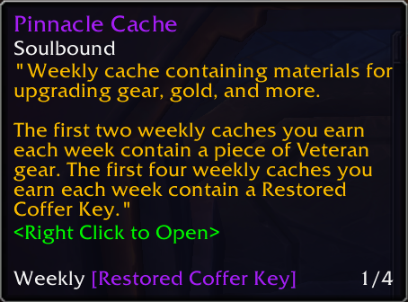

# WeeklyDelveKeys

> Show your acquired Restored Coffer Key on tooltip of the Weekly Caches

WeeklyDelveKeys simplifies tracking your weekly Restored Coffer Keys by displaying your progress (x/4) directly on tooltips for all relevant Weekly Caches. The addon automatically checks your collected keys and integrates the count seamlessly into the tooltips ensuring you never lose track of your progress toward the weekly cap. No more manual currency tab checks—just hover a cache to see if you’ve hit your 4-key limit!